# HƯỚNG DẪN SỬ DỤNG STABLE DIFFUSION ĐỂ TẠO RA NHỮNG HÌNH ẢNH CHẤT LƯỢNG

## Text2image model:

- [Midjourney](https://www.midjourney.com/home): sử dụng qua discord, model gen hình tốt qua câu lệnh đầy đủ
- Dall-e: model được OpenAI, Microsoft tích hợp vào hệ thống (miễn phí và có phí), model gen hình ảnh tốt qua 1 vài miêu tả, thân thiện với người dùng.
- Stable Diffusion: model opensource, được cộng đồng phát triển thành nhiều loại model, tính năng hỗ trợ khác nhau, khá phức tạp nhưng manual được, được nhiều dev sử dụng

## Chọn model stable diffusion nào?

Hiện tại, stable diffusion được phát triển thành các bản 1.5, 2.0, 2.1 và XL và 1 cộng đồng phát triển model này với nhiều phiên bản khác nhau nhằm tạo ra những model tạo sinh hình ảnh có chất lượng tốt. Có thể liệt kê 1 vài model chất lượng được cộng đồng đánh giá và sử dụng nhiều:
- Stable Diffusion 1.5
- Stable Diffusion 2.1
- Stable Diffusion XL base
- DreamShaperXL
- XL lighting

## txt2img, img2img và inpaint

### txt2img
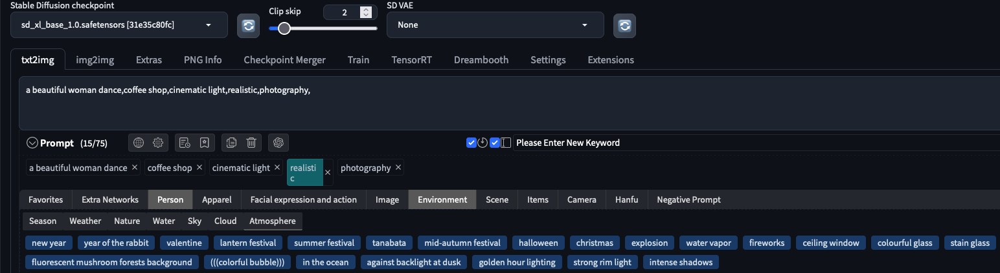

- Là tính năng chính của model, cách sử dụng khá đơn giản, bạn chỉ cần nhập 1 số từ ngữ/nội dung (bằng tiếng anh nhé) mà bạn muốn tạo ra ví dụ:
```
a beautiful woman dance, coffee shop, cinematic light, realistic, photography
```
để có thể chọn được 1 hình ảnh có nội dung và bối cảnh như mong muốn, bạn có thể dụng 1 số thông số sau để cải thiện quá trình tạo sinh

`Sampling method`: có nhiều method, bạn có thể dùng `DPM++ 2M`, `DDIM`, `Euler a`

`Schedule type`: nên sử dụng `Uniform`

`Sample steps`: steps các cao thì ảnh gen ra sẽ có nhiều chi tiết hơn nhưng sẽ lâu hơn

`Width` và `Height`: kích thước của ảnh gen ra

`CFG Scale`: (Classifier Free Guidance scale) thông số này để model sinh ảnh phải/tự do theo câu lệnh của bạn, thông số thấp sẽ model sẽ tự do sáng tạo, thông số càng cao model sẽ gen gần xác với yêu cầu. CFG 2-7 là thấp, 7-10 là cân bằng, 10-15 theo sát câu lệnh, 15> cần câu lệnh chi tiết để mô tả cụ thể từng chi tiết 

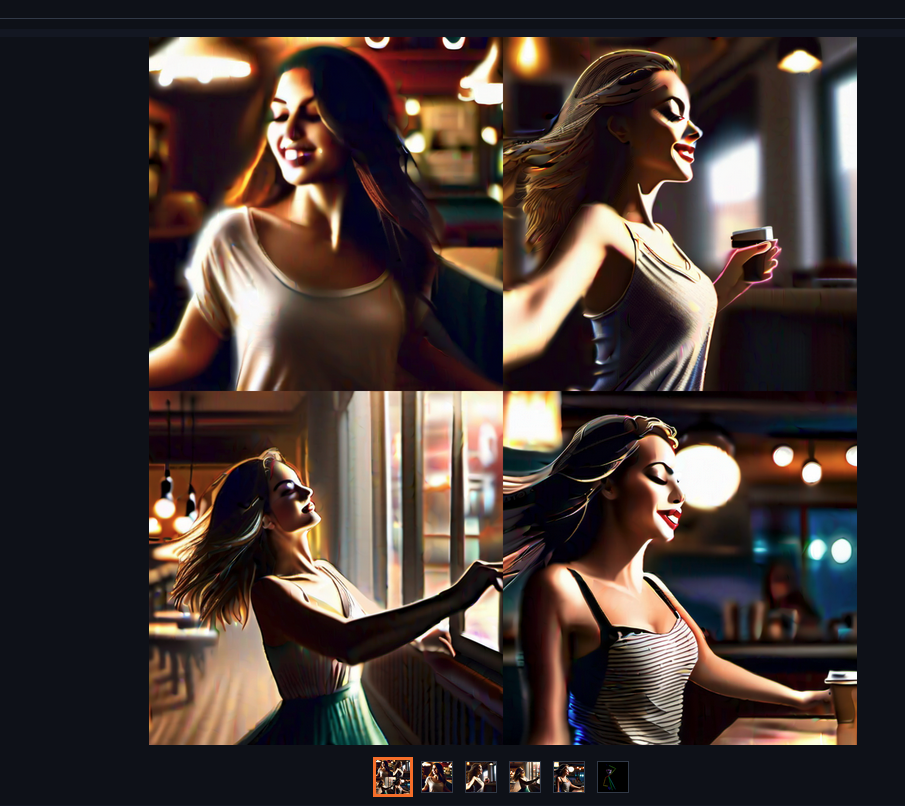

### img2img
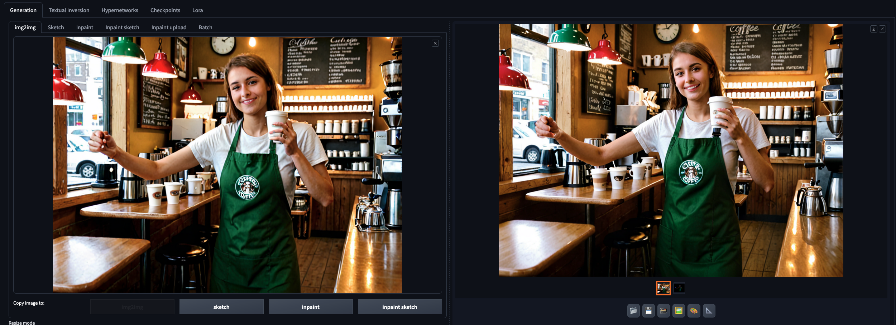
Khi đã chọn được 1 hình ảnh hợp với nội dung (bỏ qua chi tiết, sẽ có 1 số model gen ra hình xấu, ko logic, ...). Bây giờ bạn có thể dùng img2img để gen lại hình ảnh đó để có tính logic và yêu cầu hợp lý hơn. Hãy chú ý thông số sau:

`Schedule type`: bây giờ bạn nên chọn `karras`

`Denoising strength`: để gen ra các bố cảnh tương tự những các chi tiết khác sẽ thay đổi thì bạn nên chọn từ 0.6 - 0.8, nếu bạn muốn giữ lại các bối cảnh thì chọn 0.3-0.6

### inpaint
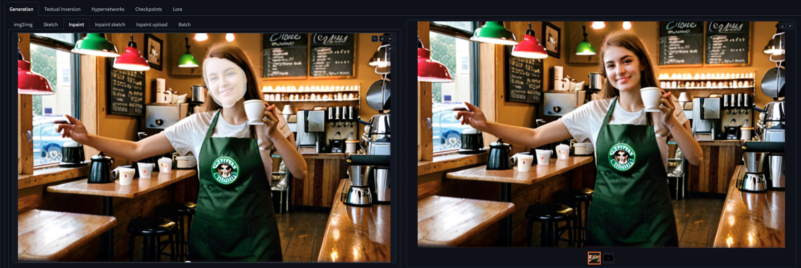
Với công cụ này, bạn có thể thay đổi nội dung, chi tiết cụ thể ở 1 vùng nhất định, để sử dụng hiệu quả bạn cần lưu ý các thông số sau:

`Inpaint area`: chọn `Only masked`

`resize to`: nên chọn resolution thấp hơn ảnh bạn sẽ gen ra, 1 ví dụ để bạn dễ hình dung

`Denosising strength`: thông số này tương tự ở `img2img`, nếu bạn muốn vùng thay đổi chỉ gen ra hình theo câu lệnh mới bạn đặt ra thì có thể chọn 0.4 - 0.5

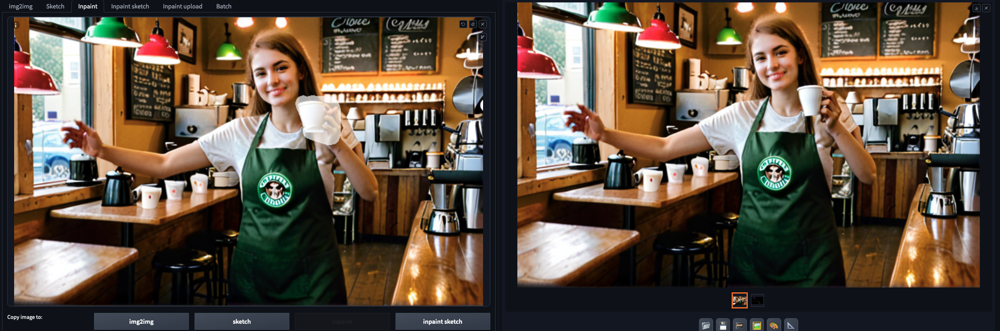

### super resolution:

kích thước hình ảnh gen ra tối đa là 768x768 nên khi gen ra được 1 hình ảnh đẹp các bạn cần 1 công cụ để tăng kích thước của hình ảnh đó. Sự dụng `Extras` và thao tác sau để tăng kích thước hình ảnh:

`Upscale 1`: chọn `R-ESRGAN 4x+`

`Resize`: chọn số lần muốn up lên (tối đa là x8)

### ControlNet

Tính năng `ControlNet` sẽ giúp bạn tạo ra những hình ảnh theo 1 chuẩn được đặt ra làm cho việc tạo sinh hình ảnh trở nên dễ kiểm soát hơn

### mode canny
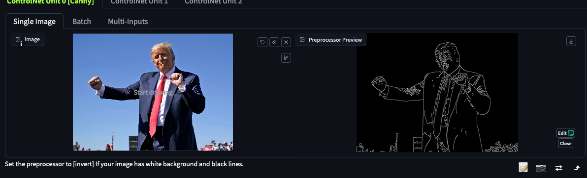
- Để sử dụng được mode canny bạn cần 1 hình ảnh có sẵn và chú ý thêm 1 số thông số sau:
`Canny Low Threshold` và `Canny High Threshold`: điều chỉnh 2 thông số này để tìm điểm màu trong ngưỡng đã set 

- Tiếp sau đó bạn có thể add thêm 1 số câu lệnh để tăng độ chính xác cho hình ảnh, model nên chọn ở đây là `DreamShaperXL`
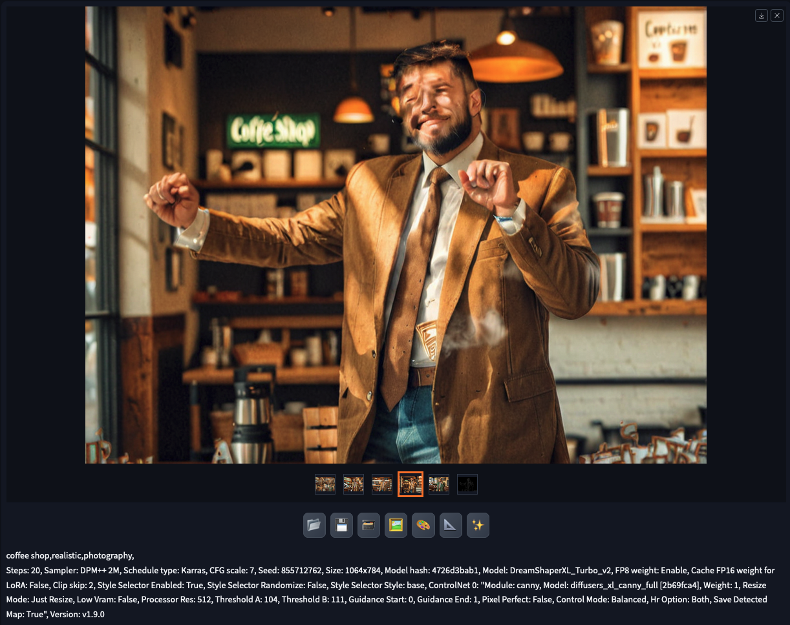
### mode openpose
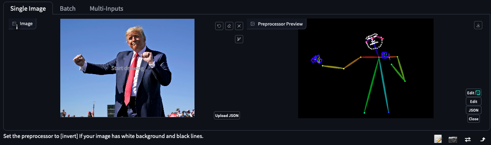
- Đối với `openPose` bạn có thể chọn 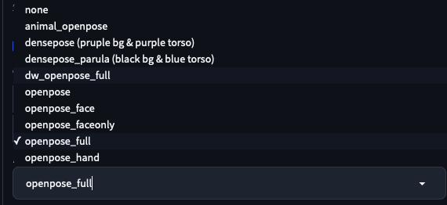 tại thông số `Proprocessor`, khuyên dùng `openpose_full` nếu có cả tay, thân và mặt

- Cũng như mode trên, bạn có thể add thêm 1 số câu lệnh để tăng độ chính xác cho hình ảnh, model nên chọn là `DreamShaperXL`

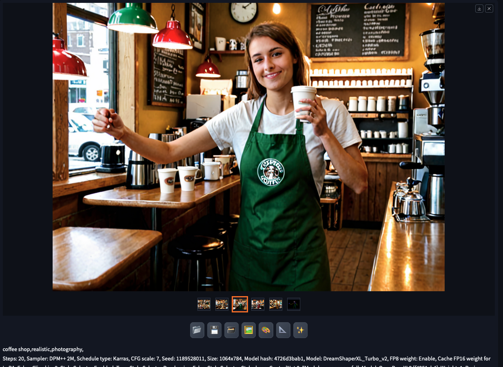

### References:
[ControlNet github](https://github.com/lllyasviel/ControlNet)

[ControlNet extension](https://github.com/Mikubill/sd-webui-controlnet)
### DreamBooth train your style

Đối với việc train Dreambooth, chúng ta chỉ đang finetuning lại model có sẵn để có thêm 1 số định nghĩa class mới, khi dùng model sdxl chúng ta không tìm câu lệnh nào để gen ra hình ảnh theo style art hoặc nhân vật mà ta mong muốn, lúc này chúng ta cần thu thập hình ảnh về những khái niệm mong muốn, ví dụ: với câu lệnh "Ngoc Trinh, sit on chair,  " thì model sẽ không hiểu khái niệm "Ngoc Trinh" là gì.  

- Chuẩn bị data: chúng ta cần thu thập các hình ảnh về đối tượng cần train với độ phân giải là 512x512 ( 768x768, 1024x1024 độ phân giải các cao thì train càng lâu), đặt tên theo số thứ tự hoặc đặt tên theo <số thứ tự>-<câu prompt>.png  
- Câu lệnh đặc biệt: hãy sử dụng những cụm từ riêng biệt để xác định câu lệnh cho đối tượng bạn muốn gen ra, ví dụ như: ngoc trinh -> gen ra hình ảnh Ngọc Trinh, icongame art -> gen ra các icon game.
- Khai báo Concept: 
    - ở tab `Concept` -> `Instance image`:

        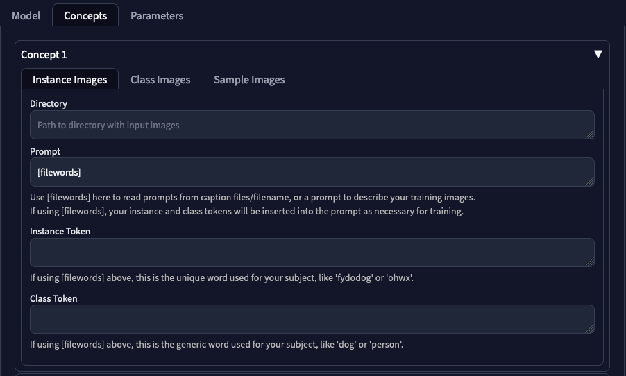

        `Directory`: thư mục chứa hình ảnh đã được chuẩn bị ở trên

        `Prompt`: nếu `Prompt` sử dụng [filename], thì bỏ qua bước này, ngoài ra bạn có thể điền câu lệnh đặc biệt ở đây và bỏ qua 2 biến số ở dưới

        `Instance token`: nếu `Prompt` sử dụng [filename], hãy điền câu lệnh đặc biệt đã xác định ở trên

        `Class token`: nếu `Prompt` sử dụng [filename], hãy điền câu lệnh class là lớp tổng quát ví dụ elly tran -> woman, girl

    - ở `Class Image`:

        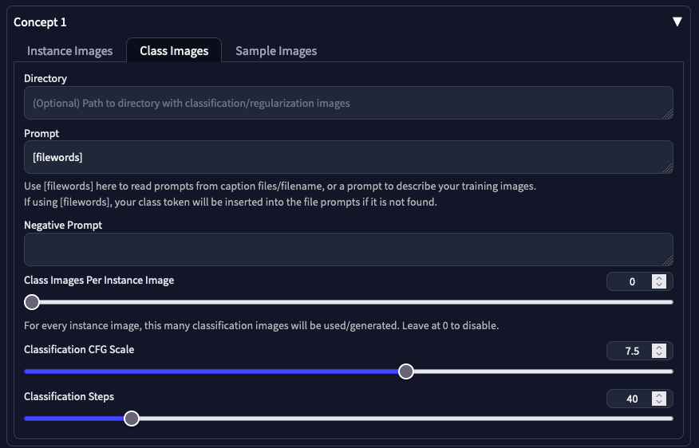
        
        `Directory (Optional)`: thư mục các hình ảnh từ class

        `Prompt`: câu lệnh tạo ảnh 

        `Negative prompt`: câu lệnh chống tạo ảnh theo các từ ra lệnh 

        `Class Images Per Instance Image`: số image gen 

        `Classification CFG Scale`: thông số câu lệnh : 7-12

        `Classification Steps`: số bước lọc nhiễu

    - ở `Sample Image`:

        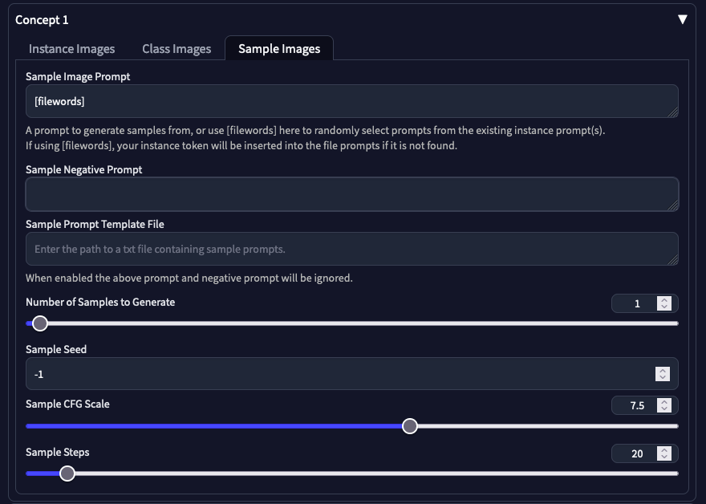

        `Sample Image Prompt`: lệnh gen ảnh mẫu trong quá trình huấn luyện

        `Sample Negative Prompt`: câu lệnh chống gen ảnh mẫu 

        `Sample Prompt Template File (Optional)`: bạn có thể dùng tập tin .txt chứ các câu lệnh gen hình mẫu

        `Number of Samples to Generate`: số hình mẫu gen trong qúa trình huấn luyện 

        `Sample Steps`: số bước lọc nhiễu

### Finetuning SD 1.5

- Tạo model: 
    - ở `Model`->`Create`:

        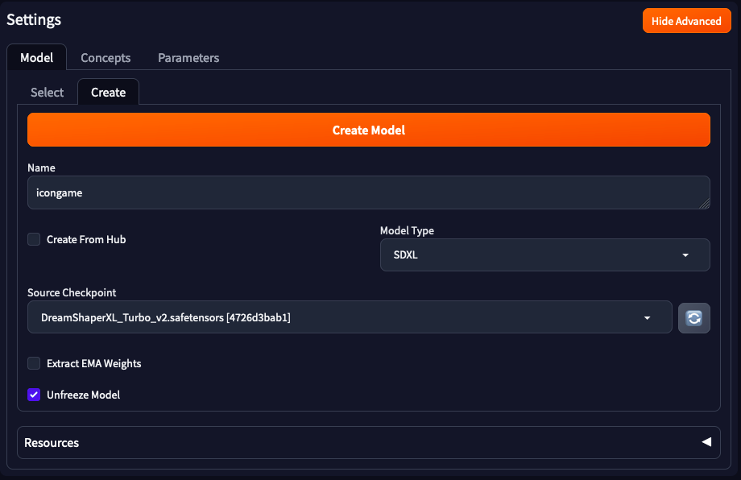

        Điền tên model bạn muốn train, `Model Type`: v1x -> `Source checkpoint`: chọn model SD v1.5 bạn muốn finetune

- setup parameters:

    ```
        Use EMA: False
        Optimizer: 8bit AdamW
        Mixed Precision: bf16
        Memory Attention: xformer
        Cache Latents: False
        Step Ratio of Text Encoder Training: 1
        Clip Skip: 2
        Pad Tokens: true
        Training Steps Per Image (Epochs): 100 - 500
        Max Resolution: 512
        Apply Horizontal Flip: true
        Use LORA: False
    ```

### Model zoo:

- Một số website cho model SD được cộng đồng phát triển: [Civitai](https://civitai.com/)
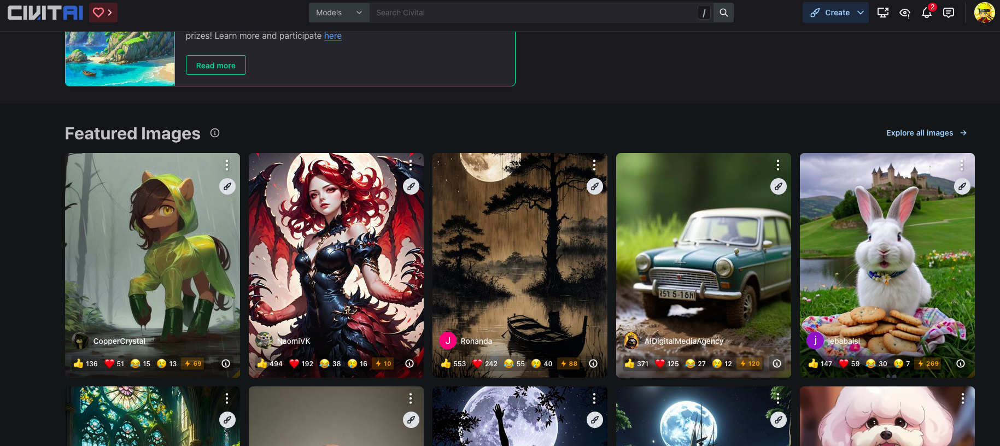

### Plugin Photoshop:

[Plugin PTS](https://github.com/isekaidev/stable.art)

[Auto-Photoshop-StableDiffusion-Plugin](https://github.com/AbdullahAlfaraj/Auto-Photoshop-StableDiffusion-Plugin?tab=readme-ov-file)

[Show case](https://www.youtube.com/watch?v=VL_gbQai79E)

### Txt-2-3D

[stable dreamfusion](https://github.com/ashawkey/stable-dreamfusion)

[shape-e](https://github.com/openai/shap-e)

[3D editor extension](https://github.com/jtydhr88/sd-webui-3d-editor)

[TripoSR](https://huggingface.co/stabilityai/TripoSR)
